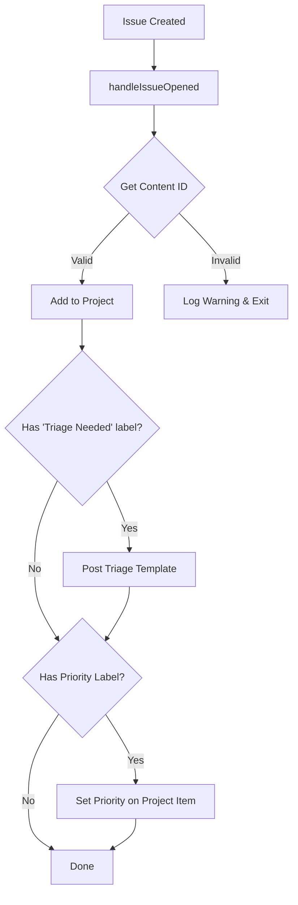
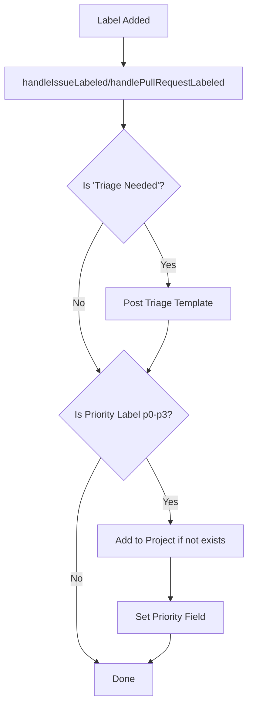
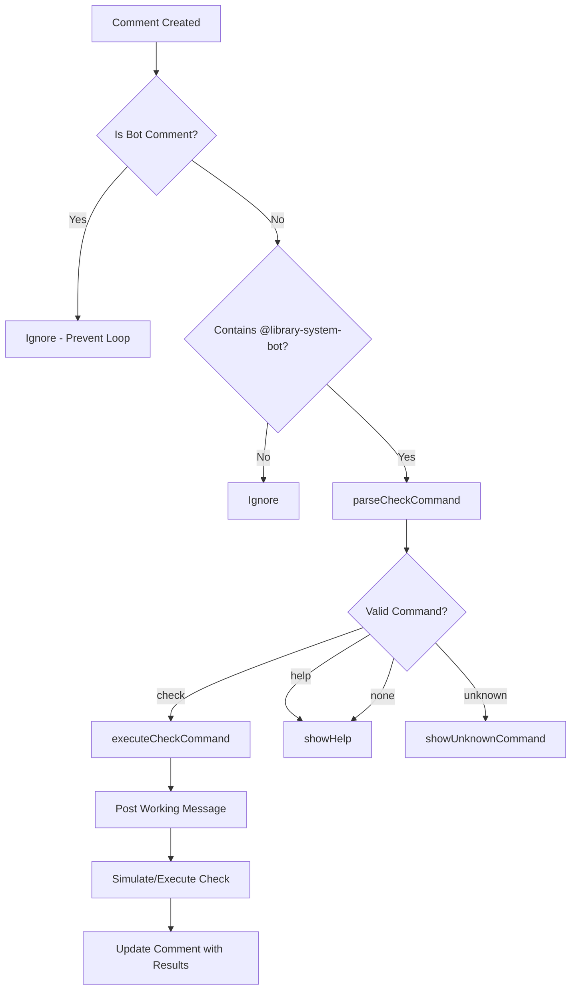

# 🏗️ Library System Bot - Architecture Documentation

## 📁 Project Structure

```
library-system-bot/
├── 📄 index.js                    # Main entry point - registers all handlers
├── 📦 package.json                # Dependencies and scripts
├── 🔧 .env.example                # Environment configuration template
├── 📚 README.md                   # Main documentation
├── 📖 QUICK_REFERENCE.md          # Quick reference guide
├── 🤝 CONTRIBUTING.md             # Contributing guidelines
│
├── src/                           # Source code
│   ├── handlers/                  # Event handlers
│   │   ├── issue-handler.js       # Handles issue events
│   │   ├── pull-request-handler.js # Handles PR events
│   │   └── comment-handler.js     # Handles comment events & commands
│   │
│   └── utils/                     # Utility modules
│       ├── banner.js              # Startup banner & version info
│       ├── check-runner.js        # Check command execution
│       ├── command-parser.js      # Parse bot commands from text
│       ├── config.js              # Configuration management
│       ├── helpers.js             # General helper functions
│       ├── logger.js              # Enhanced logging utilities
│       ├── project.js             # GitHub Project V2 operations
│       └── triage.js              # Triage template posting
│
├── test/                          # Tests
│   ├── index.test.js              # Original integration tests
│   └── utils.test.js              # Unit tests for utilities
│
├── .github/
│   └── workflows/
│       └── bot-check-runner.yml   # GitHub Actions workflow for checks
│
└── target/                        # Example target repository
    └── Library-System-v3/
```

---

## 🔄 Event Flow

### Issue Created Flow



### Label Added Flow



### Comment Command Flow



---

## 🎯 Core Components

### 1. Configuration Management (`config.js`)

**Purpose:** Centralized configuration with lazy initialization

**Key Functions:**
- `initConfig()` - Load and cache environment variables
- `getConfig()` - Get cached configuration
- `isConfigValid()` - Validate required settings

**Configuration Schema:**
```javascript
{
  projectId: string,           // GitHub Project V2 ID
  priorityFieldId: string,     // Priority field ID
  statusFieldId: string,       // Status field ID (optional)
  optionMap: {                 // Priority option IDs
    p0: string,
    p1: string,
    p2: string,
    p3: string
  },
  statusMap: {                 // Status option IDs
    'Not Started': string,
    'In Progress': string,
    'Done': string,
    "Won't Fix": string
  }
}
```

### 2. Project Operations (`project.js`)

**Purpose:** GitHub Project V2 GraphQL operations

**Key Functions:**

#### `addToProject(context, contentNodeId)`
- Adds issue/PR to project board
- Handles duplicates gracefully
- Returns project item ID

#### `setPriorityOnItem(context, itemId, priorityLabel)`
- Updates priority field on project item
- Maps label (p0-p3) to field option ID

#### `setStatusOnItem(context, itemId, status)`
- Updates status field on project item
- Optional feature for workflow automation

**GraphQL Mutations Used:**
- `addProjectV2ItemById` - Add item to project
- `updateProjectV2ItemFieldValue` - Update field values

### 3. Command System

#### Command Parser (`command-parser.js`)

Parses natural language commands from comments:

```javascript
parseCheckCommand(text) {
  // Input: "@library-system-bot check --branch=main --command=npm test"
  // Output: { type: 'check', branch: 'main', command: 'npm test' }
}
```

**Supported Commands:**
- `check --branch=<name> [--command=<cmd>]` - Run checks
- `help` - Show available commands

#### Check Runner (`check-runner.js`)

Executes check commands with:
1. Initial "working" message
2. Command execution (simulated or real)
3. Result posting with formatted output

**Future Enhancement:** Integrate with GitHub Actions workflow_dispatch

### 4. Handler Architecture

Each handler module focuses on specific events:

**Issue Handler:**
- `handleIssueOpened` - New issues
- `handleIssueLabeled` - Label changes
- `handleIssueEdited` - Issue updates

**PR Handler:**
- `handlePullRequestOpened` - New PRs
- `handlePullRequestLabeled` - Label changes
- `handlePullRequestEdited` - PR updates

**Comment Handler:**
- `handleIssueComment` - All comment activity
- Bot mention detection
- Command routing
- Help system

**Error Handling:**
All handlers use try-catch with logging:
```javascript
try {
  await performAction(context);
} catch (error) {
  context.log.error(`Action failed: ${error.message}`, error);
}
```

---

## 🔌 Integration Points

### GitHub App Events

The bot subscribes to these webhook events:

| Event | Purpose |
|-------|---------|
| `issues.opened` | Add to project, triage, priority |
| `issues.labeled` | Detect priority/triage labels |
| `issues.edited` | Re-check priority labels |
| `pull_request.opened` | Add to project, priority |
| `pull_request.labeled` | Detect priority labels |
| `pull_request.edited` | Re-check priority labels |
| `issue_comment.created` | Bot commands |

### Required Permissions

- **Issues:** Read & Write
- **Pull Requests:** Read & Write
- **Metadata:** Read

### GitHub Project V2 API

Uses GraphQL for all project operations:

**Read Operations:**
```graphql
query {
  node(id: $contentId) {
    ... on Issue {
      projectItems { nodes { id project { id } } }
    }
  }
}
```

**Write Operations:**
```graphql
mutation {
  addProjectV2ItemById(input: { projectId: $projectId, contentId: $contentId }) {
    item { id }
  }
}
```

---

## 🎨 Design Patterns

### 1. Separation of Concerns
- **Handlers** - Event orchestration
- **Utils** - Reusable logic
- **Config** - Centralized settings

### 2. Error Isolation
Each handler wrapped in try-catch to prevent cascade failures

### 3. Graceful Degradation
Bot continues working even if:
- Project operations fail
- Optional config is missing
- Individual handlers error

### 4. Logging Strategy
- Emoji-enhanced logs for readability
- Structured logging with context
- Different levels (info, warn, error, debug)

---

## 🚀 Extension Points

### Adding New Commands

1. **Parse** - Add regex to `command-parser.js`
2. **Execute** - Create handler in `utils/`
3. **Route** - Add case in `comment-handler.js`
4. **Document** - Update help message

Example:
```javascript
// 1. Parse
if (/assign\s+@(\w+)/i.test(text)) {
  return { type: 'assign', user: match[1] };
}

// 2. Execute
async function handleAssign(context, command) {
  await context.octokit.issues.addAssignees({
    ...context.issue(),
    assignees: [command.user]
  });
}

// 3. Route
case 'assign':
  await handleAssign(context, command);
  break;
```

### Adding New Auto-Actions

1. Create handler function
2. Register event in `index.js`
3. Update `app.yml` with required events/permissions

---

## 🧪 Testing Strategy

### Unit Tests (`test/utils.test.js`)
- Test pure functions in isolation
- Command parsing logic
- Helper functions

### Integration Tests
- Mock GitHub API responses
- Test full event flows
- Use fixtures from `test/fixtures/`

### Manual Testing
- Use Smee.io for local webhook delivery
- Test with real GitHub repository
- Verify project board updates

---

## 📊 Performance Considerations

### API Rate Limits
- GraphQL counts as 1 call per mutation/query
- Project operations use 1-2 calls per action
- Cached configuration prevents repeated reads

### Optimization Opportunities
1. **Batch Updates** - Group multiple field updates
2. **Caching** - Cache project item IDs
3. **Async Operations** - Parallel execution where safe

---

## 🔒 Security

### Secrets Management
- Never commit `.env` file
- Use environment variables for all secrets
- Rotate private keys periodically

### Webhook Validation
- Probot validates webhook signatures automatically
- `WEBHOOK_SECRET` must match GitHub App settings

### Bot Comment Detection
Prevents infinite loops by ignoring bot's own comments:
```javascript
if (comment.user.type === 'Bot') {
  return; // Ignore all bot comments
}
```

---

## 📈 Monitoring & Observability

### Log Levels
- `trace` - Very verbose, all details
- `debug` - Development, detailed flow
- `info` - Production, major events
- `warn` - Potential issues
- `error` - Failures

### Key Metrics to Track
- Event processing time
- API call success rate
- Command execution rate
- Project update success rate

---

## 🔮 Future Enhancements

### Planned Features
1. **GitHub Actions Integration** - Real check execution
2. **Status Automation** - Auto-move project cards
3. **Custom Commands** - User-defined workflows
4. **Dashboard** - Web UI for bot statistics
5. **Multi-Project Support** - Work across multiple projects

### Extension Ideas
- Auto-assign based on file paths
- SLA tracking for priority levels
- Release note generation
- Automated changelog updates

---

<sub>📝 Last Updated: October 2025 | 🤖 Library System Bot v1.0.0</sub>
